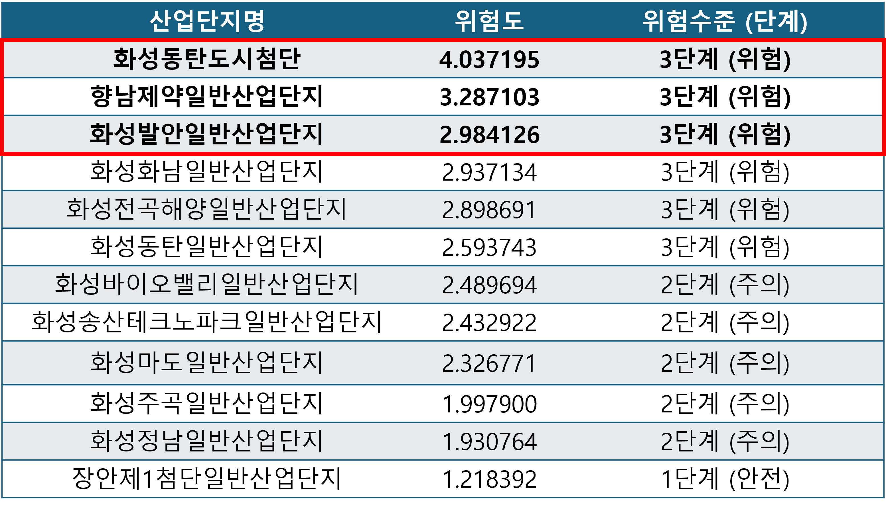
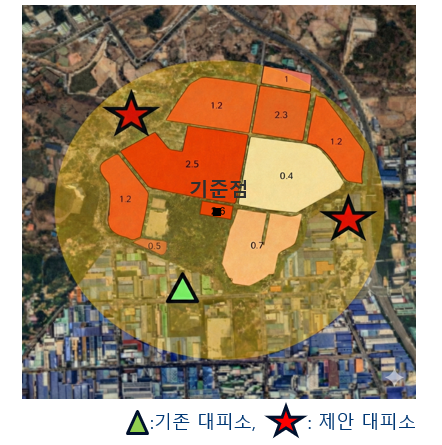
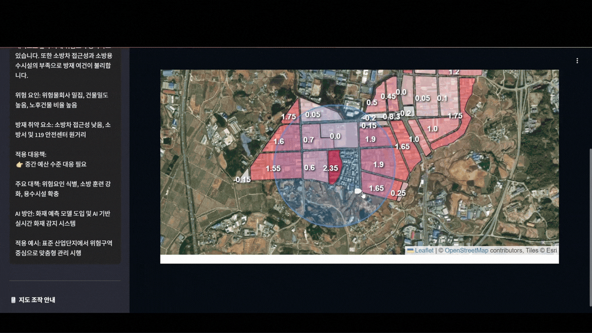

# 화성시 도시데이터 기반 산업단지 맞춤형 화재 대응 전략

## 1. Project Overview
본 프로젝트는 **『제2회 화성시 도시데이터 연구공모전』 대상 수상작**입니다. 화성시의 데이터 분석을 통해 화재 취약점을 파악하고, 실효성 있는 'Urban AI' 정책 수립을 목표로 하였습니다. 전체 프로세스는 **문제 정의 → 데이터 분석 및 모델링 → 해결책 제시 → 웹 데모 배포**의 과정으로 수행되었습니다.

## 2. Problem Definition
* **화재 빈도:** 지난 10년 간 전국 지자체 중 총 화재 건수 1위(8,009건)를 기록하며 화재 위험도가 매우 높음.
* **산업적 특성:** 타 지역 평균 대비 약 16.5배 많은 공장이 밀집되어 있으며, 전체 화재 최초 착화물의 22%가 공장에서 기인함.
* **목표:** 데이터 기반의 산업단지 맞춤형 화재 대응 및 예방 전략 수립 필요.

## 3. Methodology
화성시 내 12개 산업단지를 대상으로 다각도의 공간 분석 및 위험도 평가를 진행하였습니다.

1. **거시적 위험도 평가:** 산업단지별 밀집도, 소방서와의 거리, 평균 출동 시간 등의 변수를 활용하여 화재 위험도를 산출, 상위 3개 위험 지역(Top 3)을 선정.
2. **미시적 구역 분석:** 선정된 산업단지 내부를 세분화하여 소화전 교차 버퍼 비율, 구역별 출동 시간, 건물 밀도 등의 변수를 기반으로 구역별 정밀 위험도 재측정.
3. **DX 전략 수립:** 분석 결과를 종합하여 단지별 맞춤 대응 전략 도출 및 디지털 전환(DX) 기반의 안전 대책 수립.

## 4. Proposed Solution
분석된 위험 데이터를 바탕으로 물리적 인프라 개선과 기술적 솔루션을 제안합니다.

* **대피소 최적화:** 소방청 권고 기준인 화재 지점 반경 600m(도보 대피 가능 거리) 버퍼 분석을 통해, 대피 사각지대에 신규 대피소 설치 건의.
* **스마트 방재 시스템 도입:** 고위험 구역 내 AI CCTV 도입을 통한 초기 화재 탐지 및 진압 시스템 구축. 수집된 데이터를 활용한 3D 모델링 기반 대피 시나리오 생성 및 초동 대처 가속화.

## 5. Tech Stack
* **Data Analysis & Visualization:** Python
* **GIS & Spatial Analysis:** QGIS (위성지도 매핑, 버퍼/교차/네트워크 분석)
* **Deployment:** Streamlit (웹 데모 구현), Ngrok

## 6. Key Results

### 6.1. 산업단지별 화재 위험도 분석

* 분석 결과 "화성동탄도시첨단", "향남제약일반산업단지", "화성발안일반산업단지"가 위험도 상위 3개 지역으로 선정되었습니다.
* 해당 지역을 중심으로 시범 분석 및 솔루션 적용을 진행하였습니다.

### 6.2. 대피소 사각지대 시각화 및 제안

* **현황 분석(향남제약일반산업단지):** 기존 대피소(Green)가 기준점(Black) 대비 산 아래에 편중되어 있어, 화재 발생 시 신속한 접근이 어려움을 확인하였습니다.
* **개선안:** 공간 분석 결과를 바탕으로 접근성을 고려한 신규 대피소(Red) 위치를 제안합니다.

### 6.3. 웹 데모 시연

* 분석 모델 및 시각화 결과를 사용자가 직관적으로 확인할 수 있도록 QR 코드 기반의 웹 데모를 배포하였습니다.

## 7. References
* [Development of a Fire Risk Assessment System for Industrial Complexes Using GIS](https://kieae.kr/_common/do.php?a=full&b=12&bidx=3791&aidx=41801)